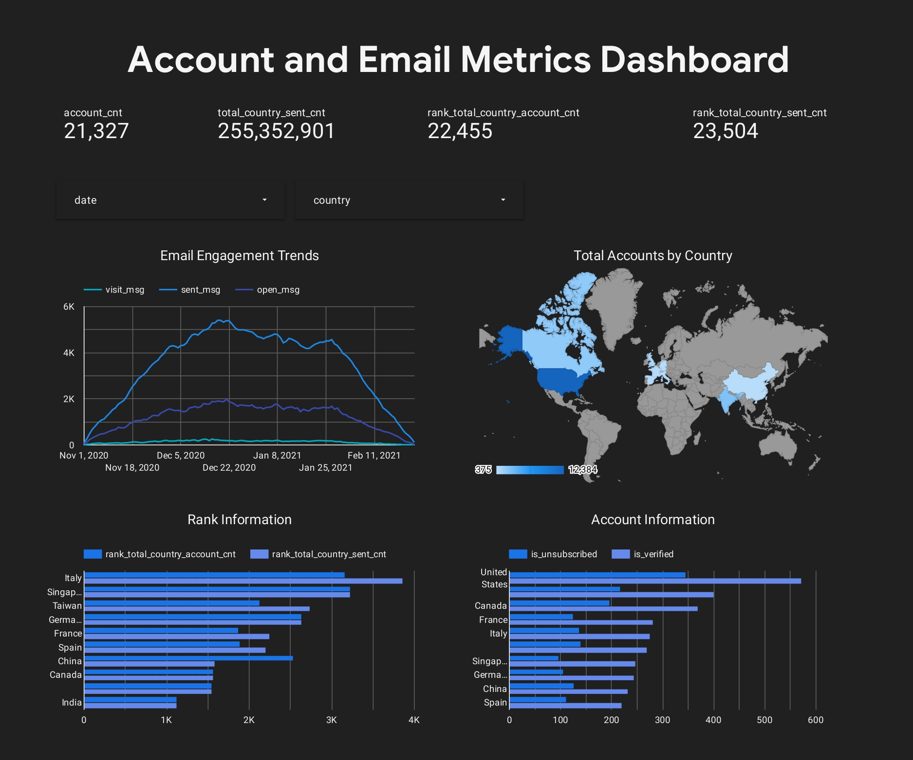

# User Behavior and Email Campaign Performance Analysis (SQL & Looker Studio)

This project analyzes user behavior and email campaign performance using an e-commerce dataset in BigQuery. The main goal is to create a dataset that helps track account creation dynamics, user activity with emails (sent, opened, clicked), and evaluate user segmentation based on sending intervals, account verification status, and subscription status.

## 🔍 Project Goals

- Analyze user account creation trends and email activity by date and country.
- Segment users by sending interval, account verification (`is_verified`), and subscription status (`is_unsubscribed`).
- Calculate key metrics including:
  - Number of accounts created (`account_cnt`)
  - Number of emails sent (`sent_msg`)
  - Number of emails opened (`open_msg`)
  - Number of email link clicks (`visit_msg`)
- Rank countries by total account creation and total emails sent to identify top markets.
- Combine account and email metrics in one dataset using SQL `UNION`.
- Filter results to include only top 10 countries by accounts or emails sent.

## 📊 Tools & Skills Used

- **BigQuery SQL**: complex queries with CTEs (Common Table Expressions), window functions for ranking, grouping and aggregations.
- **Looker Studio**: interactive dashboards and data visualizations.
- **Data analysis**: user behavior, email campaign effectiveness, segmentation, ranking.

## 📁 Dataset Structure

The final dataset includes the following fields:

- `date` — account creation date or email sent date
- `country` — user country
- `send_interval` — email sending interval set by user
- `is_verified` — account verification status
- `is_unsubscribed` — subscription status
- `account_cnt` — number of accounts created
- `sent_msg` — number of emails sent
- `open_msg` — number of emails opened
- `visit_msg` — number of email link clicks
- `total_country_account_cnt` — total accounts created per country
- `total_country_sent_cnt` — total emails sent per country
- `rank_total_country_account_cnt` — rank of countries by accounts created
- `rank_total_country_sent_cnt` — rank of countries by emails sent

## 📄 Deliverables

- SQL query with detailed comments explaining logic and structure.
- Looker Studio dashboard visualizing:
  - **Email engagement trends (sent, opened, clicked messages) over time.**
  - **Total accounts created by country (map visualization).**
  - **Country rankings by total account creation and total emails sent.**
  - **Account information by country, including subscription and verification status.**

## 📈 Visualization of Results

Below is the graphical representation of the analyzed data, showing key trends and metrics from the user behavior and email campaign performance analysis.

